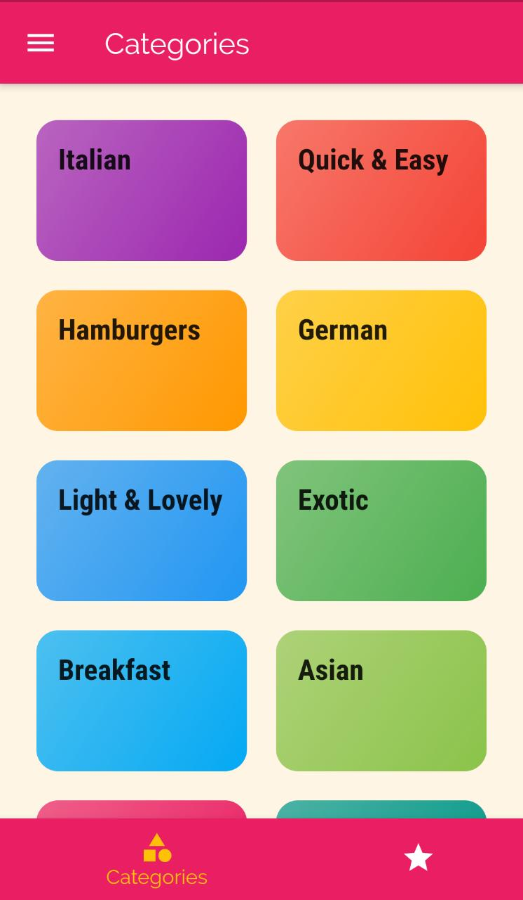
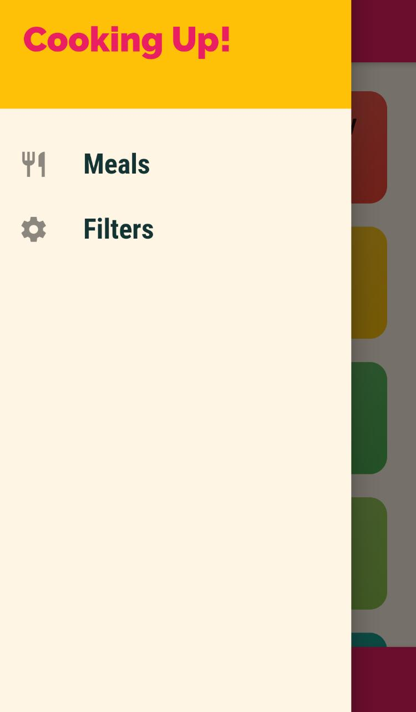

# Meal Recipe Flutter App
### This is an static flutter app where :-
- We can view the recipe .
- Can filter  recipes based on 4 parameters.
- Mark recipes as favorite.
### Note:- This is a static project 
Data get destroyed when we close the app .

## Screenshots

 
 
 
 
 
 
 

 

